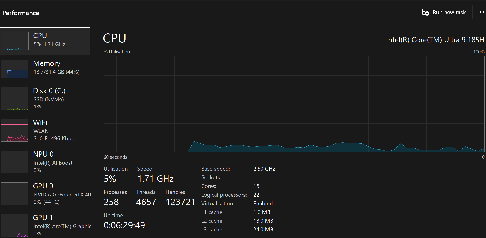
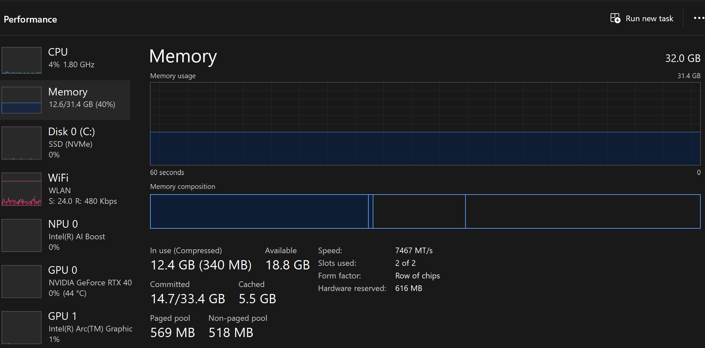
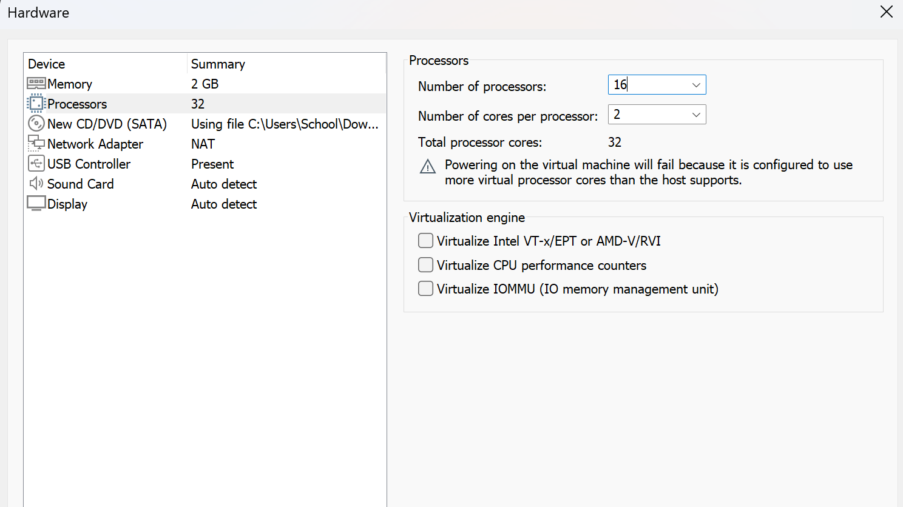
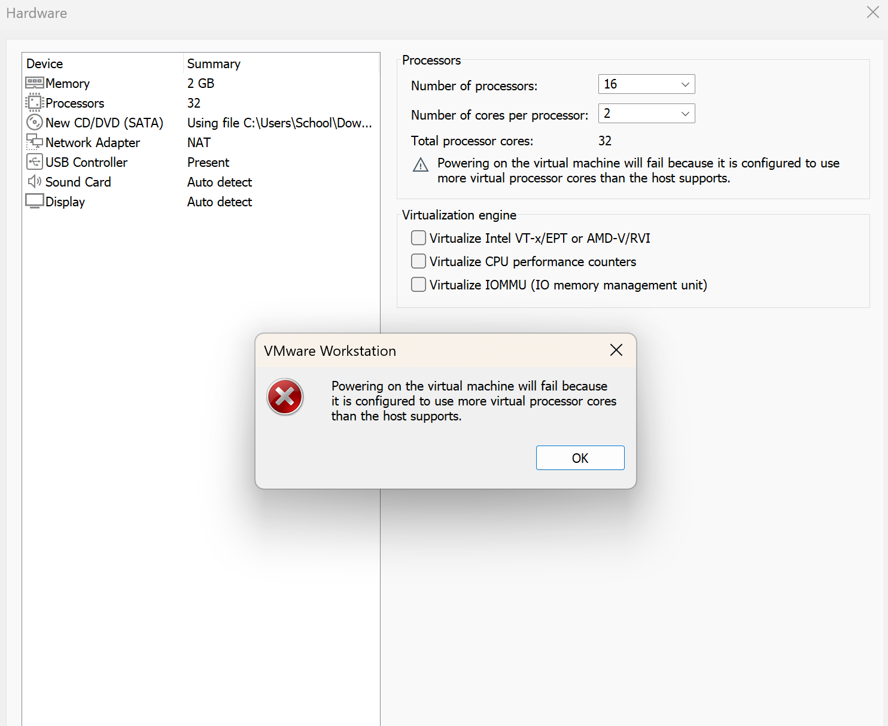
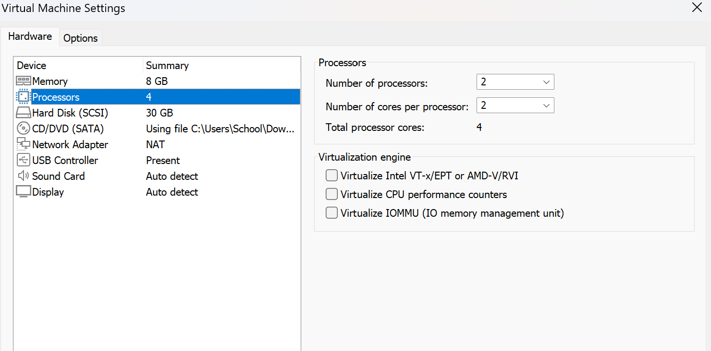
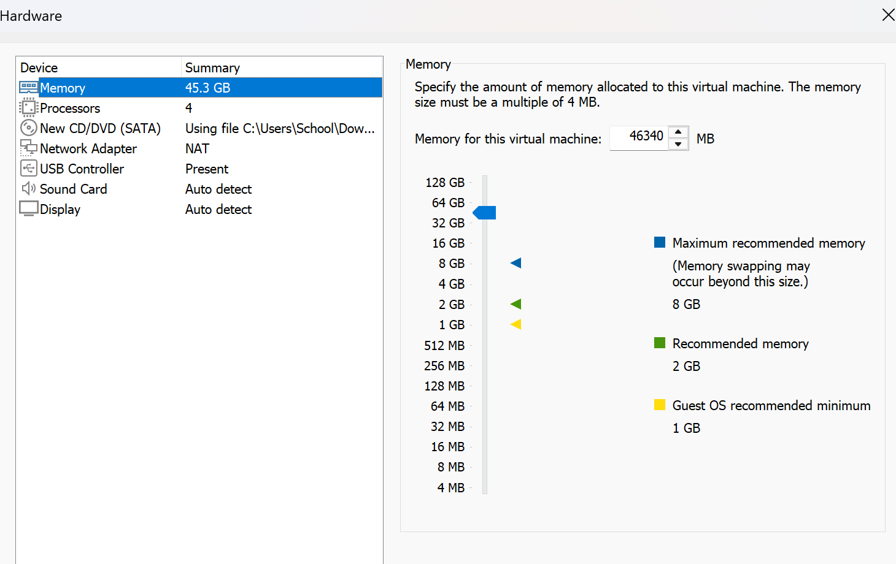
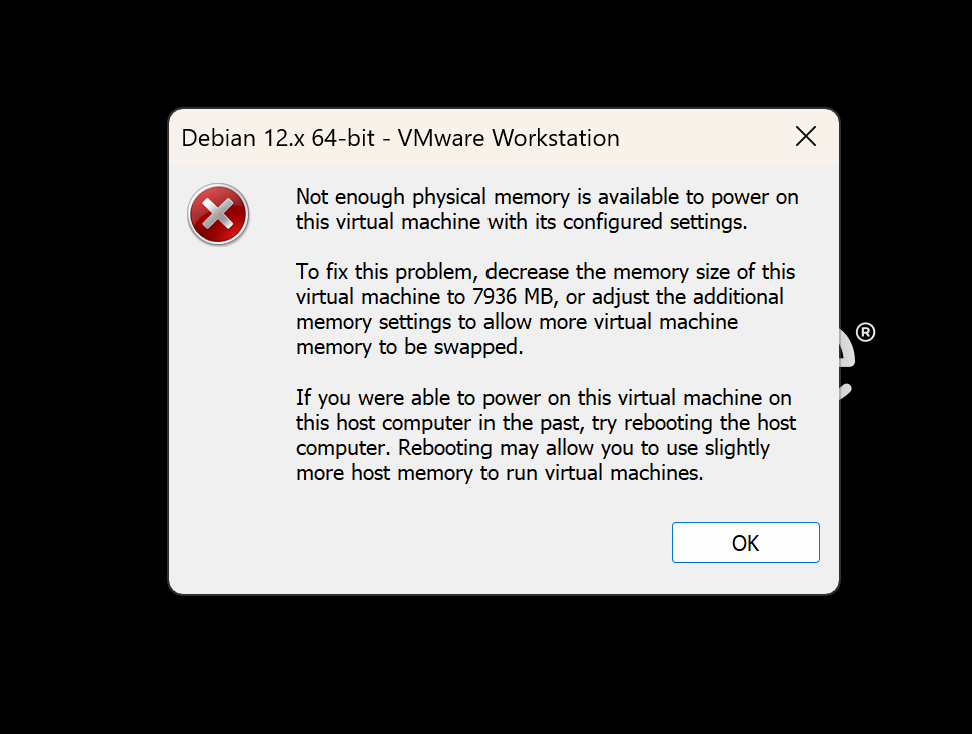
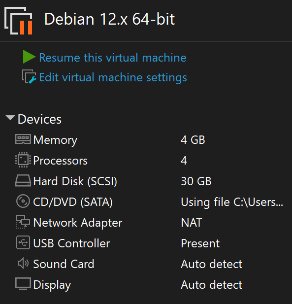
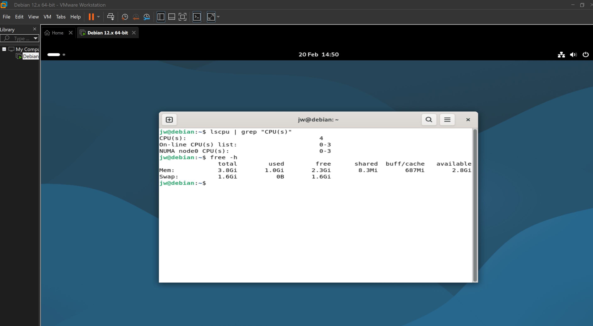

# Virtualisierung

## Auftrag A - Hypervisor

* Software zur **Virtualisierung**
* Ermöglicht mehrere **virtuelle Maschinen (VMs)** auf einem physischen Computer
* Jede VM hat ein eigenes Betriebssystem
* Verwaltet Hardware-Ressourcen (CPU, RAM, Speicher)

### Hypervisor Typ 1 (Baremetal)

* Läuft **direkt auf der Hardware**
* Kein zusätzliches Betriebssystem darunter

**Vorteile:**
* Hohe Leistung (direkter Zugriff auf CPU, RAM, Speicher)
* Sehr stabil (wenn der Hypervisor stabil läuft, laufen auch die VMs stabil)
* Hohe Sicherheit (kleinere Angriffsfläche)

**Nachteile:**
* Installation komplexer
* Weniger geeignet für private Nutzung

---

### Hypervisor Typ 2 (Hosted)

* Läuft **auf einem bestehenden Betriebssystem**
* Wird wie ein normales Programm installiert

**Vorteile:**
* Einfach zu installieren (wie normales Programm)
* Keine spezielle Serverhardware nötig

**Nachteile:**
* Geringere Leistung (von Betriebsystem Host zu Hypervisor zu VM)
* Abhängig vom Host-Betriebssystem (wenn Windows abstürzt - VM auch weg)
* Weniger stabil als Typ 1

---

## Auftrag B - Virtualisierung
### Vermutung Virtualisierungssoftware
* Wir vermuten das VMWare eine Hypervisor Typ 2 ist da es wie eine **normales Programm** auf den Computer funktioniert und dementsprechen auf dem Betriebssystem des Computers läuft. 
* War **einfach zu installieren** was auch auf Hypervisor Type 2 hinweist. 
--- 
### Host-System
* **Logische Prozessoren/ CPU: 22**

* **RAM/ Arbeitsspeicher: 32 GB**

---
### Einstellungen VM
* **CPU: 2 mal 16** -> **Fehlermeldung** darf nicht mehr CPU benutzen als Host-System -> **Korrektur auf 4**

  
 

* **RAM: 45 GB** -> **Fehlermeldung** RAM muss unter 8 GB liegen -> **Korrektur auf 4 GB**  

  

---
### Überprüfen über VM-Terminal
* Mit **Terminal-Befehl** wurde hier die CPU und RAM der VM überpüft

---
### Wieso der VM nicht mehr RAM oder CPU zugeteilt werden darf als Host-System: 
* **Vermutung**: Da Hypervisor Typ 2 auf dem Betriebsystem des Hosts läuft und keine echten Hardware-Ressourcen hat, kann es nur auf die Ressourcen des Host-System zugreifen weswegen diese auch nicht überschritten werden dürfen. 
* **Erklärung**: Vermutung hat sich bestätigt. Hypervisor verwaltet die physisch vorhandenen Ressourcen des Computer (RAM & CPU) -> die VM bekommt nur einen Anteil davon. VM kann keinen Speicher/Prozessoren benutzen die nicht real vorhanden sind. 
---
### Virtualisierungssoftware - Vermutung VM Type
* Vermutung hat sich bestätigt. Die Virtuelle Maschine auf VMWare ist von Hypervisor Typ 2. Da VMWare ein Programm ist welches erst laufen kann wenn das Programm vom User auf dem Host-System aufgerufen wird.