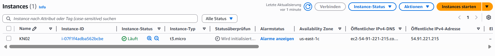
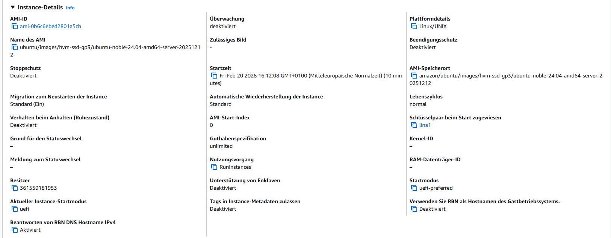
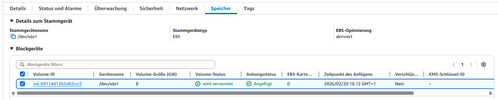
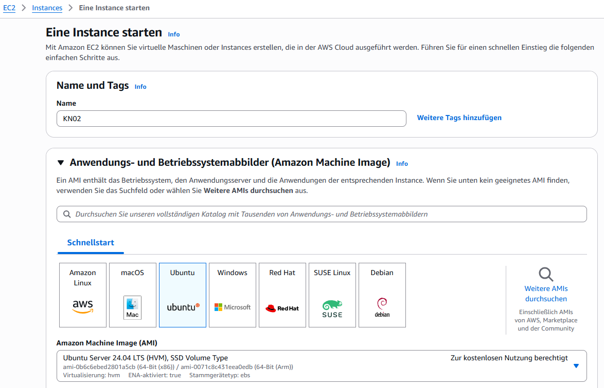
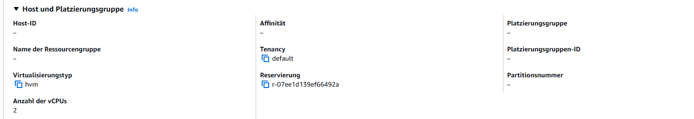
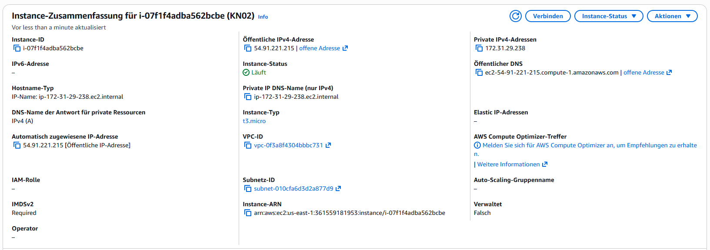
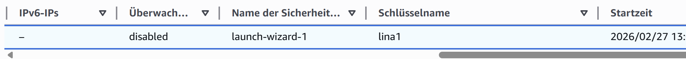
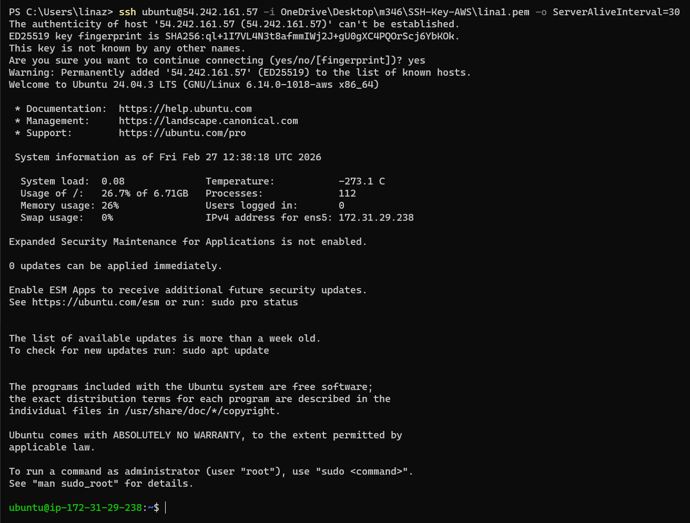
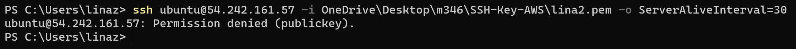

# Iaas - Virtuelle Server
## Auftrag B - Instanz erstellen
* Liste der Instanzen

--- 
* Deatils zu der Instanze KN02

    * Diskgrösse: 8 GiB
    
    * Betriebssystem: Ubuntu 24.04
    
    * Grösse des RAM: 3797 MB
    
    * Anzahl der CPUs: 2
    
    * IP-Adresse: 54.242.161.57
    
---
## Auftrag C - Zugriff mit SSH-Key
* Verwendung des ersten Schlüssels - lina1

    * ssh-Befehl & Resultat
    
* Verwendung des zweiten Schlüssels - lina2

    * ssh-Befehl & Resultat
    
    * Funktioniert nicht weil nur Schlüssel lina1 der Instanz zugeordnet ist.
---