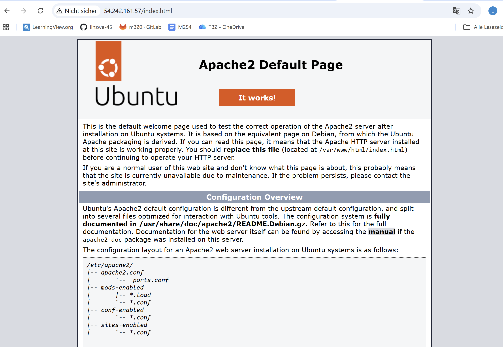
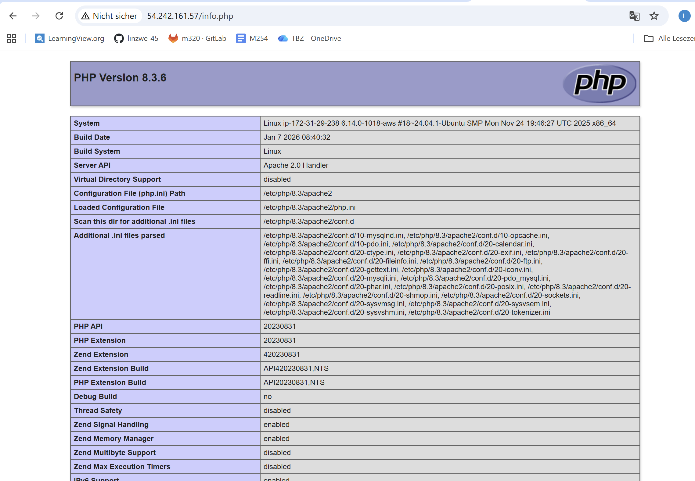
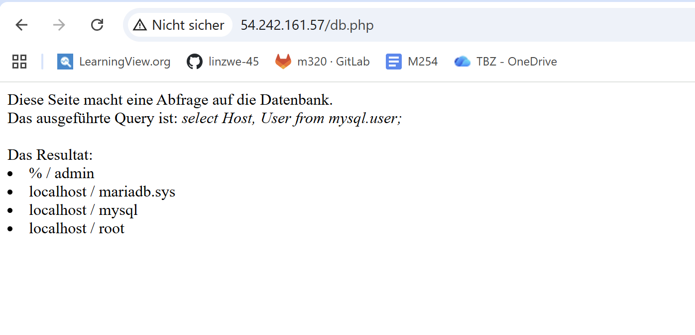
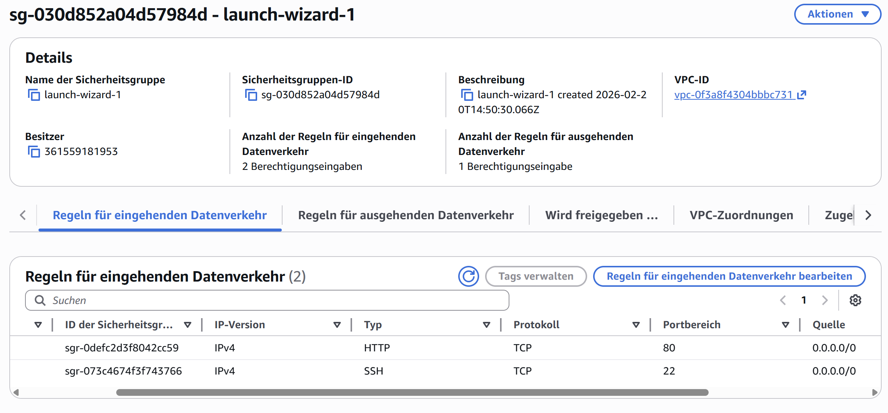
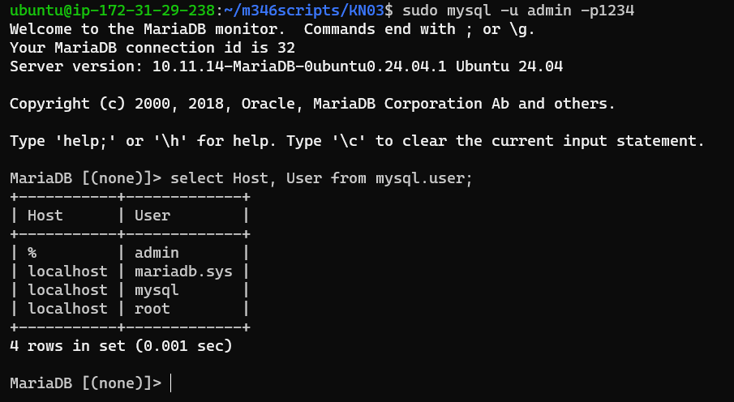

# IaaS - Virtuelle Server
## Auftrag A - Installation von Web- und Datenbankserver
* Funktionierende Webseite

* Öffentliche IP-Adresse: 54.242.161.57

* Regeln der Sicherheitsgruppe

* Befehl zum Einloggen in mysql Konsole + Resultat der Abfrage

* Erklärung SQL-Abfrage (SELECT)
    * Wählt alle Datenbankbenutzer (User) aus und zeigt, von welchen Hosts sie sich verbinden dürfen.
        * Host '%' - darf von überall zugreifen
        * Host 'localhost' - nur lokale anmelden
---