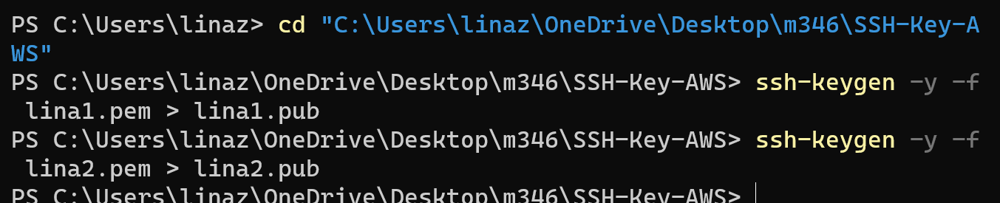
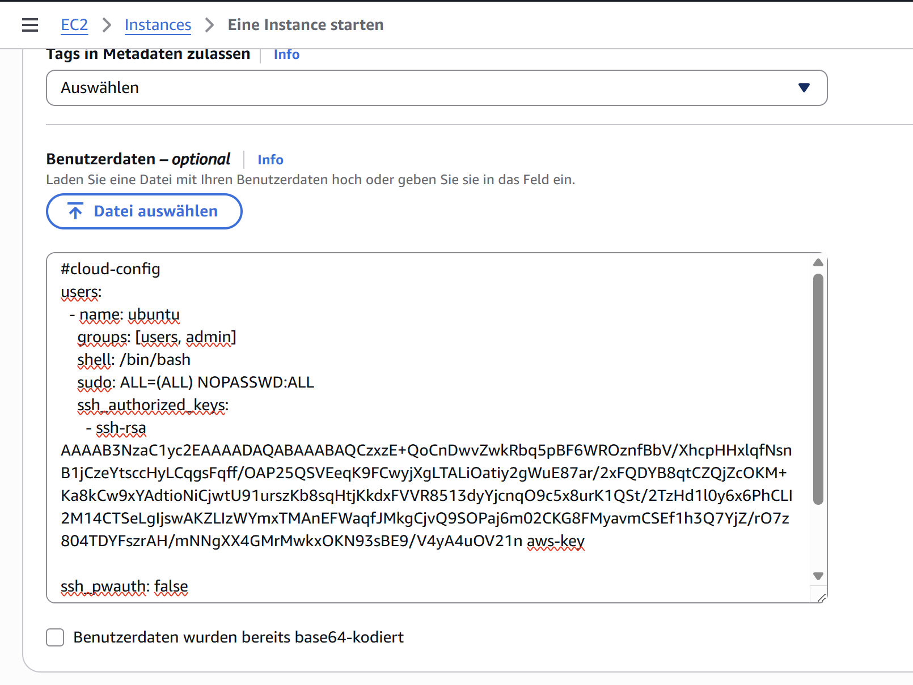
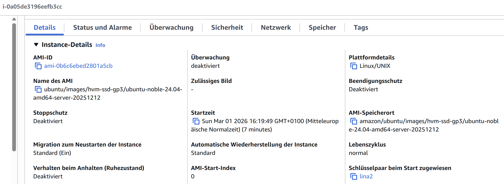
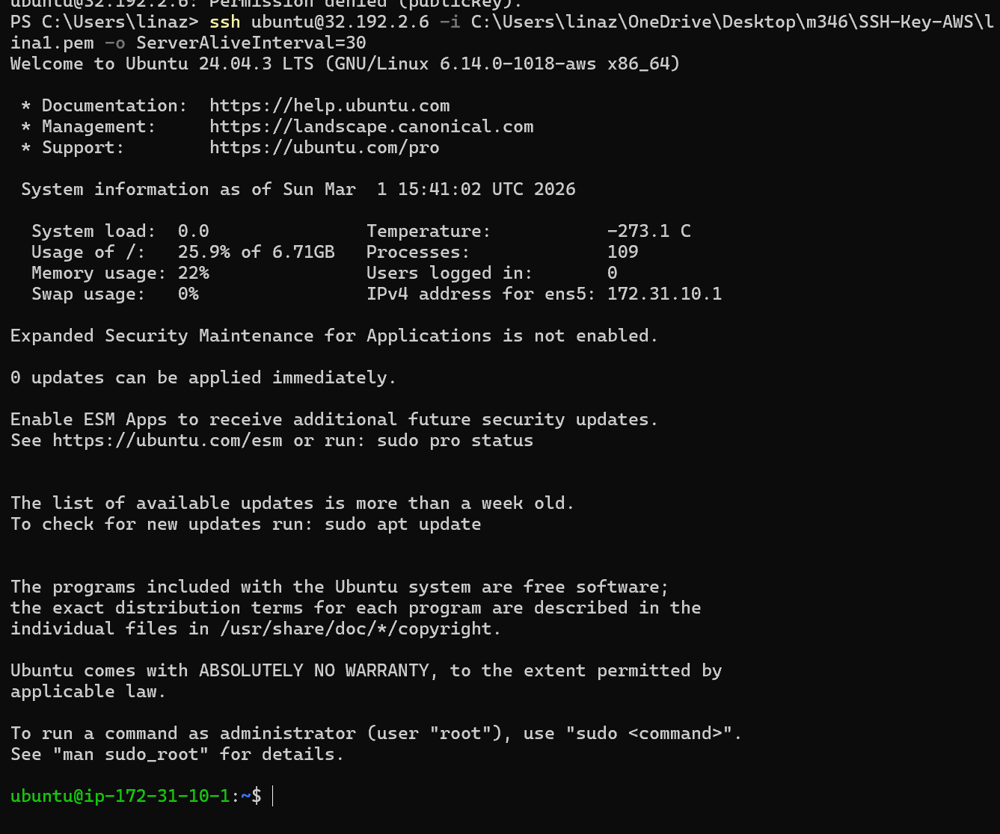
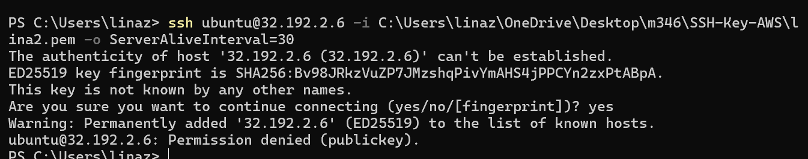
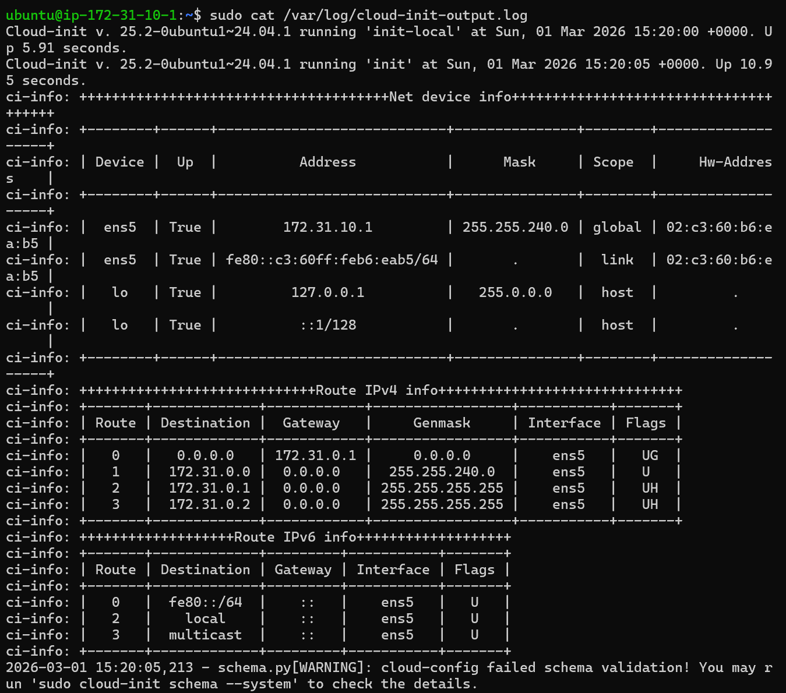

# Cloud_init und AWS
## Auftrag A - Cloud-init Datei verstehen 
* [Yaml-File - cloud-init-A.yaml](cloud-init-A.yaml)
## Auftrag B - SSH-Key und Cloud-init
* Öffentliche Schlüssle aus privaten Schlüssel erstellen


* Cloud-Init-File mit meinem öffentlichen Schlüssel
    [Yaml-File - cloud-init-B.yaml](cloud-init-B.yaml)
* Instanze KN04 erstellen:
    
    
* Details der Instanz - Feld "Schlüsselpaar beim Start zugewiesen"
    
* Verwendung des ersten Schlüssels Cloud-init - lina1 
    * ssh-Befehl & Resultat
    
* Verwendung des zweiten Schlüssels - lina2
    * ssh-Befehl & Resultat
    
* Cloud-Init-Output-Log

    * Befehl: ```sudo cat /var/og/cloud-init-output.log```
## Auftrag C - Template
* Cloud-init File mit öffentlichen Schlüssel LZ & PAT
    * [Yaml-File - cloud-init-Template.yaml](cloud-init-temp.yaml)
## Auftrag D - Installation automatisieren 

---