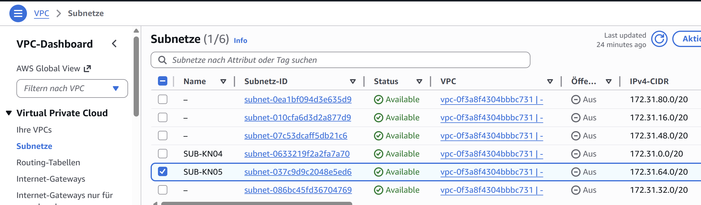
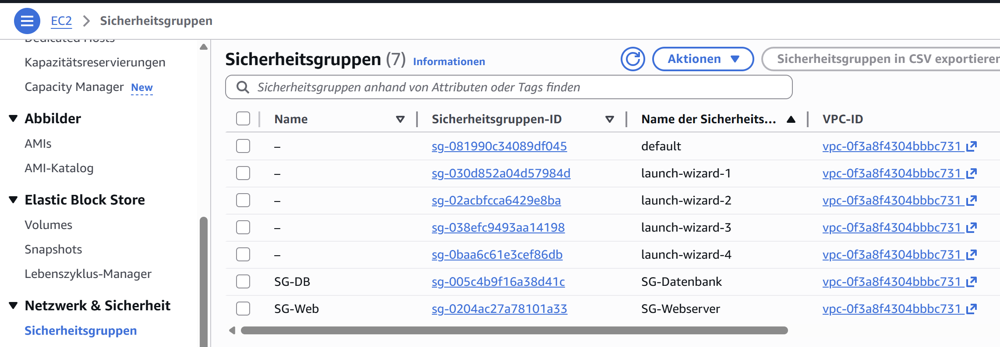
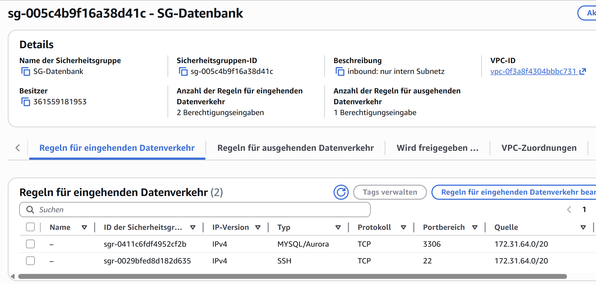
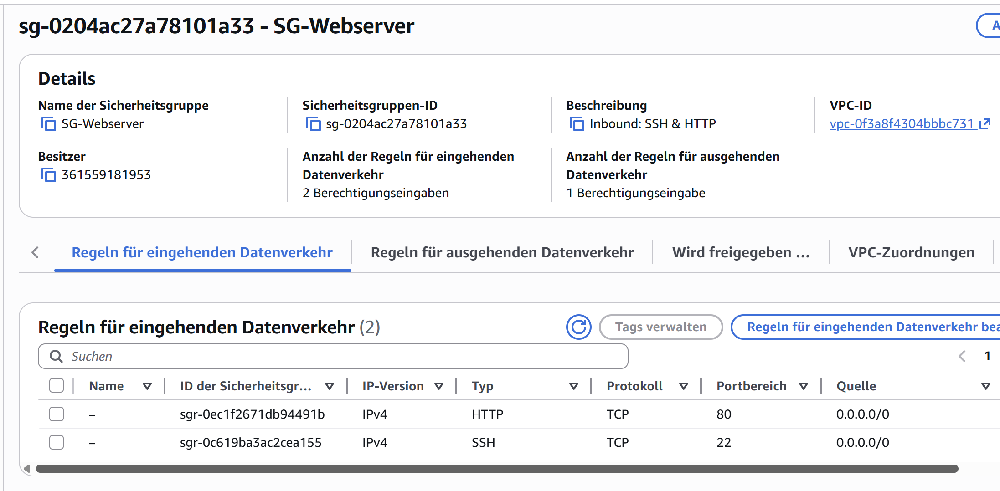
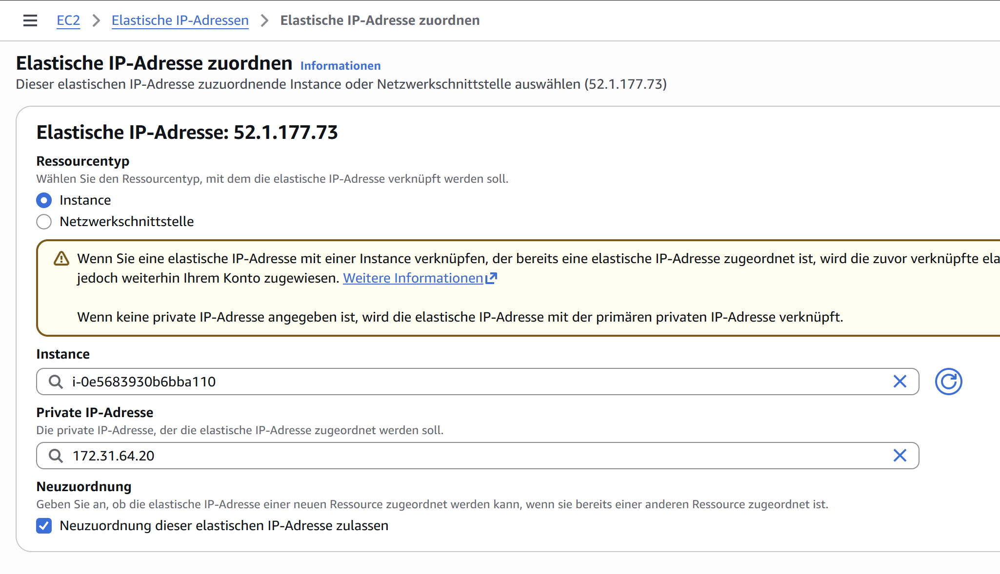
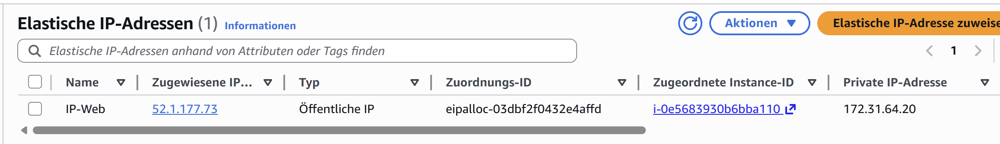
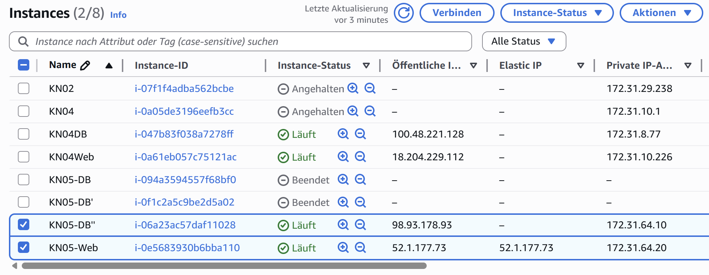
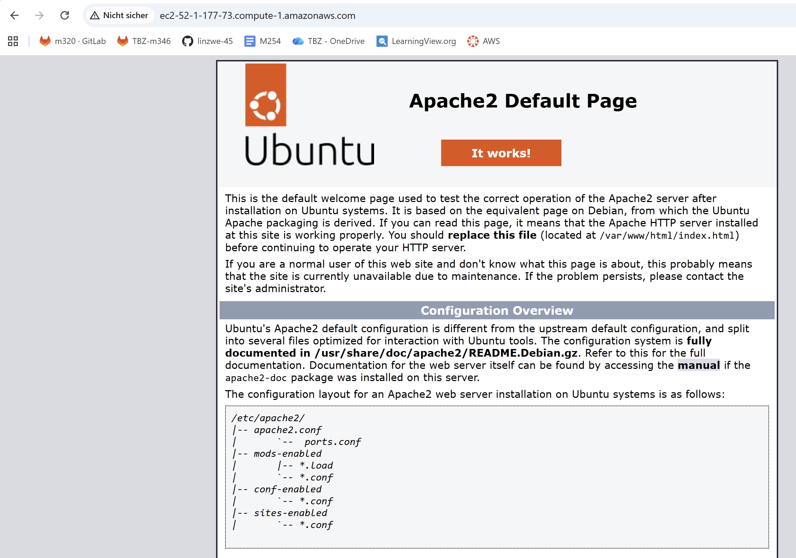
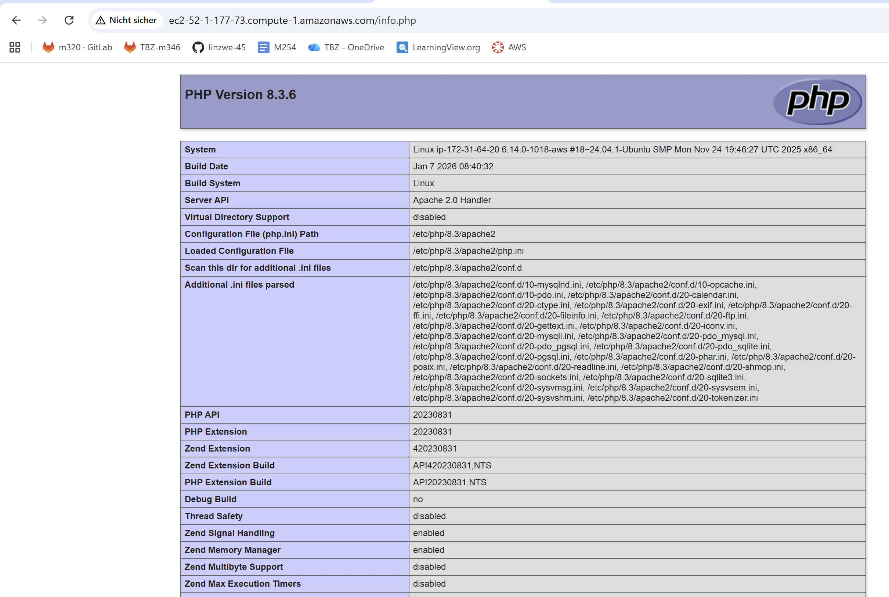
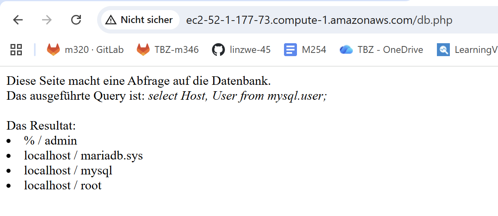

# Netzwerk / Sicherheit
## Auftrag A - Grundbegriffe & private IP wählen
* VPC (Virtual Private Cloud):
    * Privates Netzwerk in der Cloud in dem meine Instanze evt laufen
* Subnet = Teilbereich des VPC Netzwerks (unterteilt VPC in kleinere Netzwerke)
    * Anzahl Subnets vordefiniert = 6
    * Decken die IP Ranges des Subnets den gesamten IP Range des VPC ab?
        * Nicht unbedingt, Subnets nur als Teilbereiche der VPC, wenn nicht alle Verwendet dann können freie IP-Bereiche in der VPC bleiben.  
* Public IP = Im Internet erreichbar -> um Server von aussen zu erreichen (Bsp. Webseiten oder SSH Zugriff)
* Private IP = Nur im internen Netzwerk (VPC) sichtbar, nicht direkt vom Internet erreichbar, für Kommunikation zwischen Instanzen 
* Static IP = IP-Adresse die sich nicht ändert (kann öffentlich oder privat sein)
* Screenshot Subnetz-Liste

* Zwei definierte IPs für Web- und DB-Instanze
    * 1) IP1 = 172.31.64.10
    * 2) IP2 = 172.31.64.20
    * 
## Auftrag B - Objekte und Instanzen erstellen
### Sicherheitsgruppe
* Liste der Sicherheitsgruppen

* Inbound-Regeln für beide Sicherheitsgruppen

### Öffentliche, statische IP
* Liste der Elastic IPs mit erstellter IP

### Instanzen erstellen
* Liste der Instanzen mit Details zu Subnet ID

* Funktionierende Webseiten

---