# Skalierung
## Auftrag A - Installation App
* Reverse Proxy =  Server, der zwischen dem Internet (Benutzern) und Webservern steht und Anfragen an diese Server weiterleitet (wie Rezeption im Hotel)
* Swagger-URL
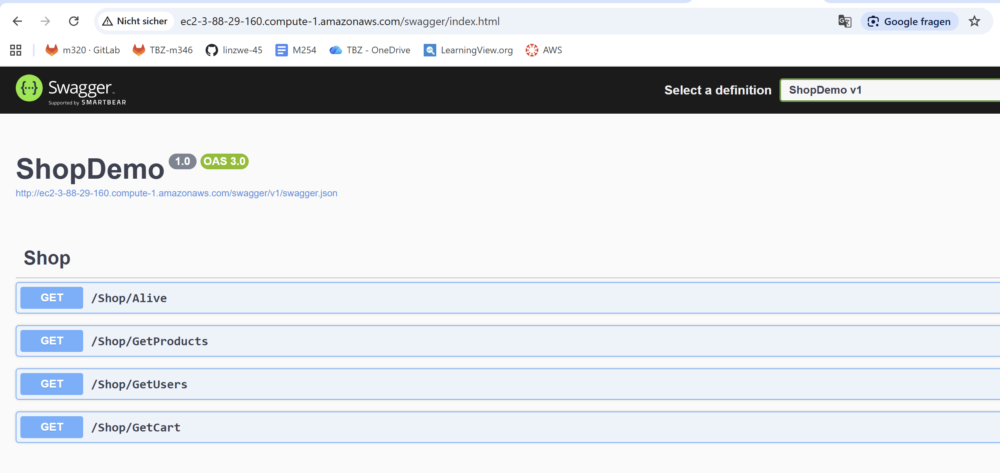
    * GetProducts
    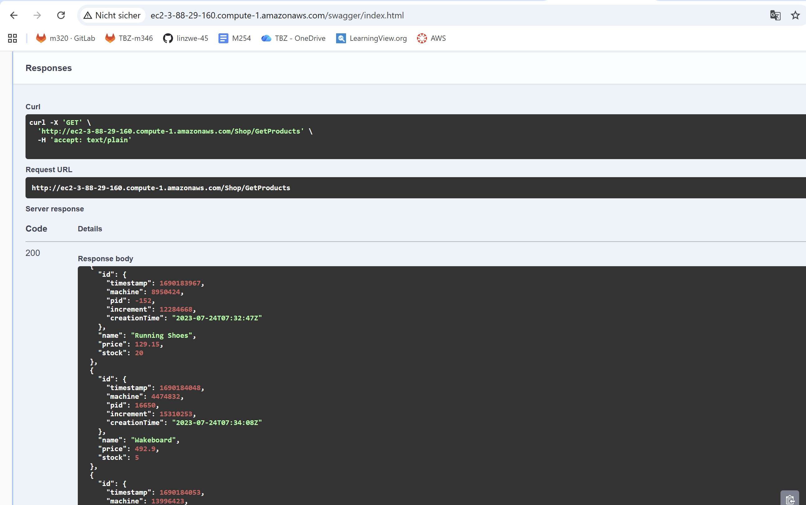
* MongoDB Collection
    * 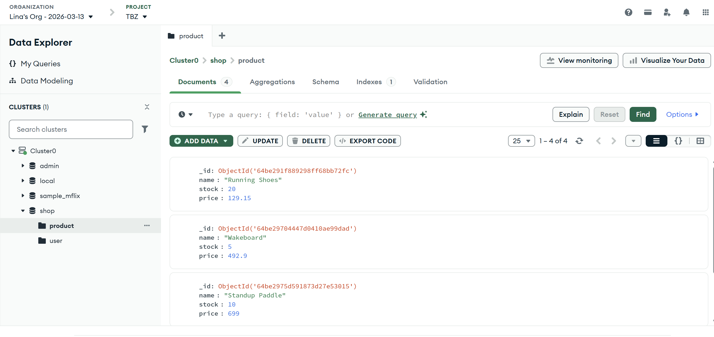
* Cloud-Init nicht gut für Produktive Umgebung: Passwörter für MonoDB soll nicht Hardcodiert im Code sein, disable_root soll true sein (aktuell hat Root volle Kontorlle über das System)
## Auftrag B - Vertikale Skalierung
* Disk auf 20 Gb erweiter. -> geht im laufenden Betrieb
    * Erklärung mit Bildern
    * 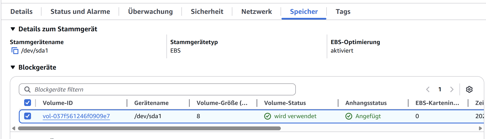
    * 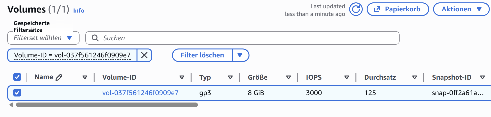
    * 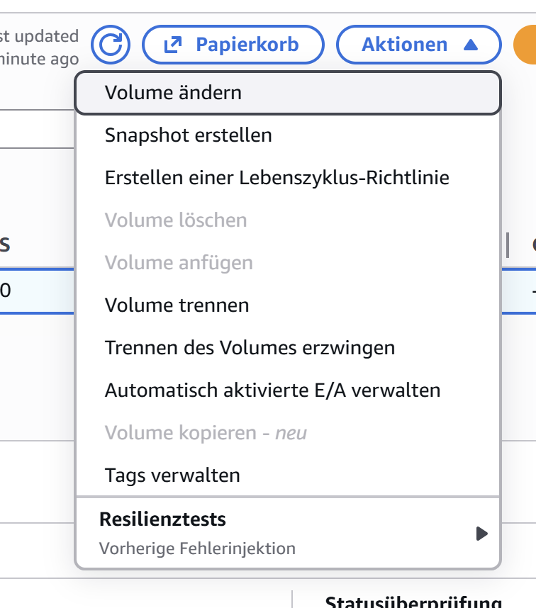
    * 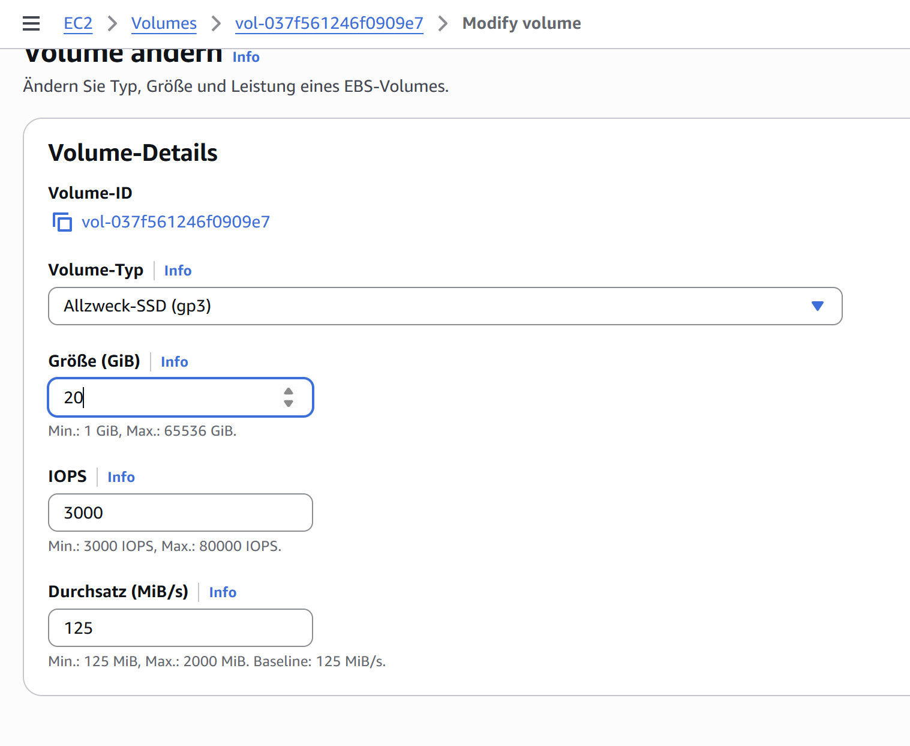
    * 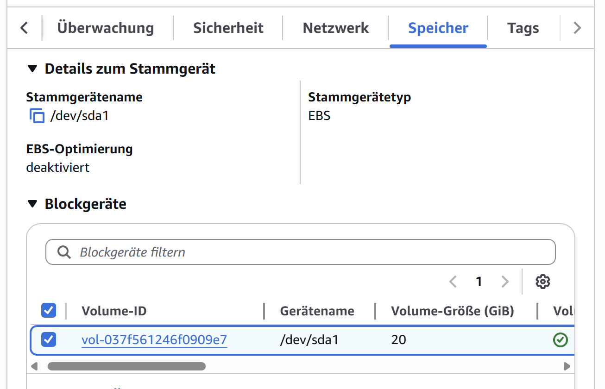
* Instanztyp zu t2.medium ändern. -> Instanze muss gestoppt werden
    * Erklärung mit Bildern
    * 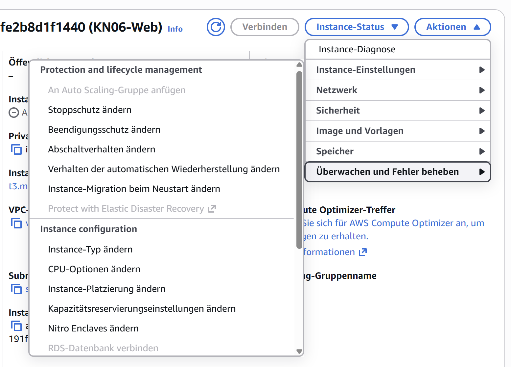
    * 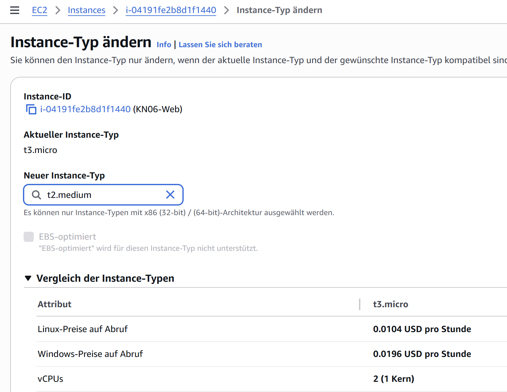
    * 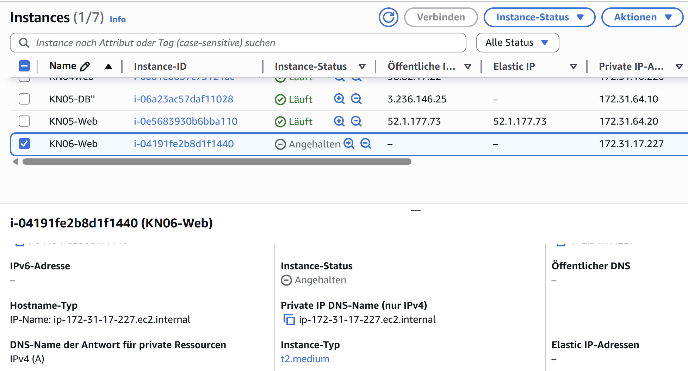
## Auftrag C - Horizonatle Skalierung
* Erklärung zum DNS= Domain Name System, übersetzt leicht merkbare Namen wie www.beispiel.de in IP-Adressen wie 192.168.1.1, die Computer verstehen
    * Im DNS Alias-Eintrag auf AWS Load Balancer konfigurieren.
        * Name: app.tbz-m346.ch 
        * Typ: A - IPv4 adresse (Alias)
        * Ziel: DNS des Load Balancer (amazonaws)
    * Der DNS fragt die Domain app.tbz-m346.ch ab → der Alias verweist auf x.elb.amazonaws.com → Anfrage wird vom Load Balancer entgegengenommen → Weiterleitung an die dahinterliegenden Server/Container der Applikation.
* Swagger-Aufruf über LoadBalancer URL (muss sichtbar sein)
    * 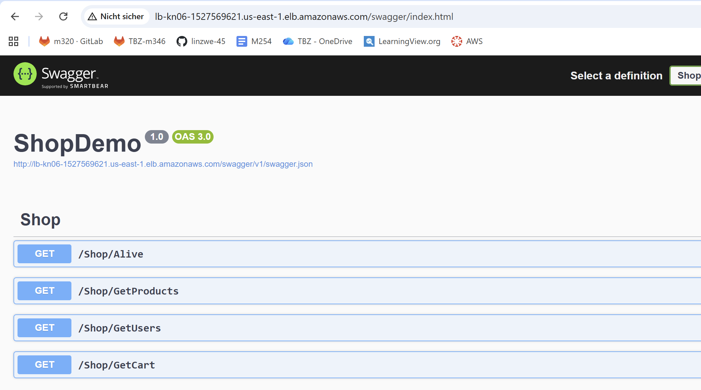
* Objekte:
    * LoadBalancer= verteilt Anfragen auf mehrere Server (damit keine überlastung einzelner Maschinen)
    * Target Group= Gruppe von Servern/Instanzen auf die der LoadBalancer die Anfrage weiterleitet
    * Health Check= prüft ob ein Server in der Target Group funktioniert; wenn nicht dann kommen keine Anfragen dort rein
    * IPs= Adressen, unter denen ein Server im netzwerk erreichbar ist
    * Sicherheitsgruppen= Regeln, die festlegen, welche Daten rein- oder raus dürfen (Firewall)
    * Listener= Lauschpunkt bei LoadBalancer, der auf bestimmte Ports wartet, um ANfragen entgegenzunehmen 
## Auftrag D - Auto Skalierung
* Objekte:
    * Template = Datei legt fest:
        * Welche Ressourcen erstellt werden, Welche Konfigurationen diese Ressourcen haben, Wie die Ressourcen miteinander verbunden sind
    * Health Check= prüft ob ein Server in der Target Group funktioniert; wenn nicht dann kommen keine Anfragen dort rein
---

MongoDB pw: 4VbNHSDfeFjv0WZ2

ssh ubuntu@107.20.39.228 -i C:\Users\linaz\OneDrive\Desktop\m346\SSH-Key-AWS\lina1.pem -o ServerAliveInterval=30