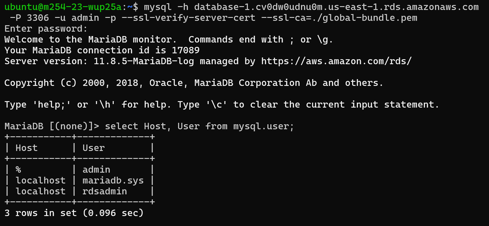
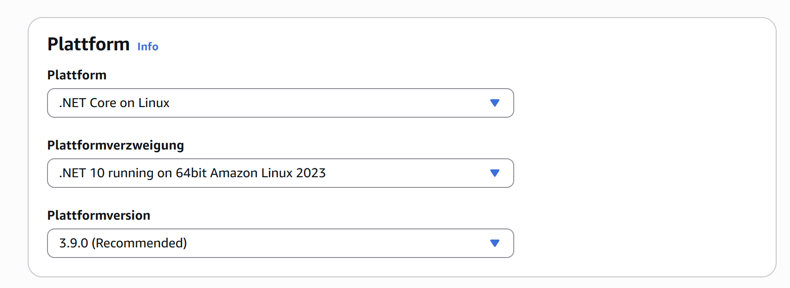
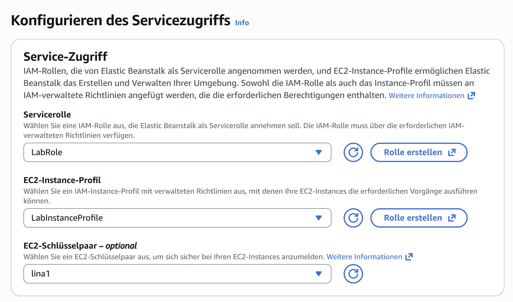
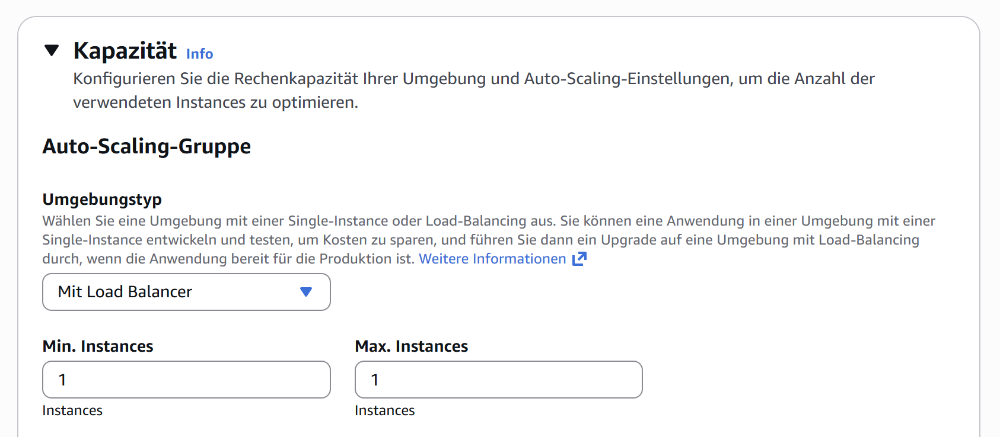
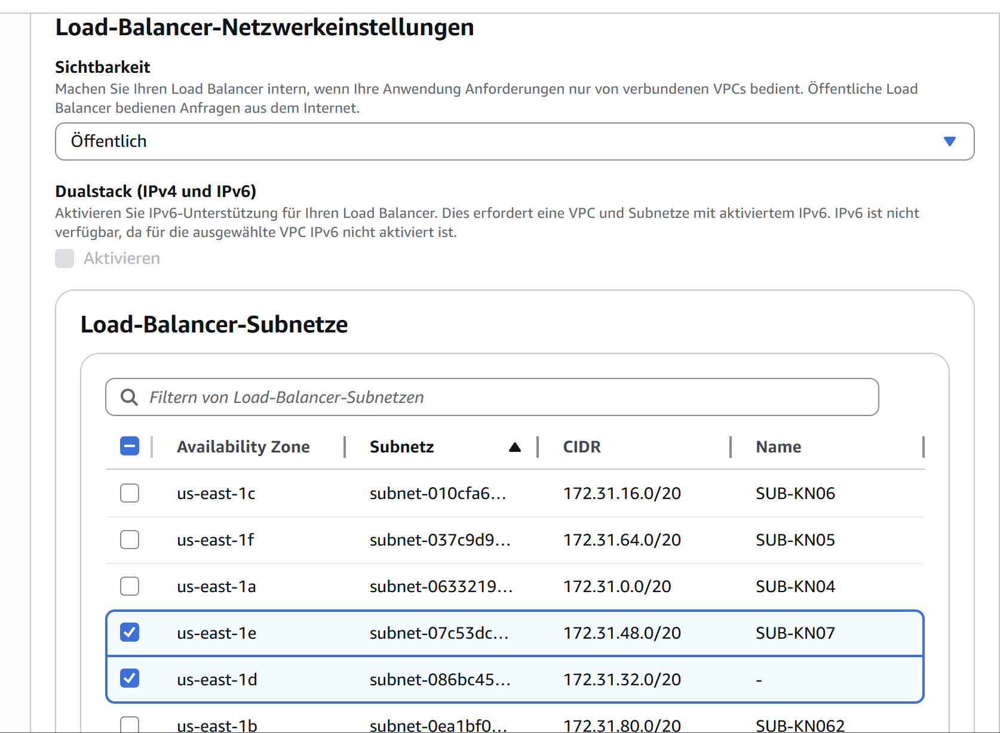
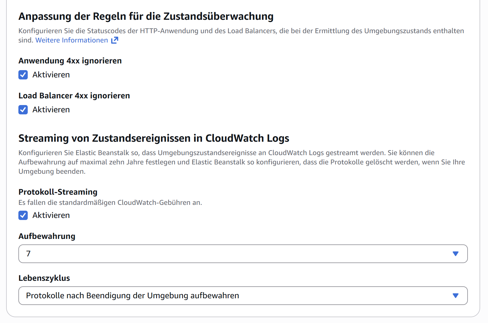
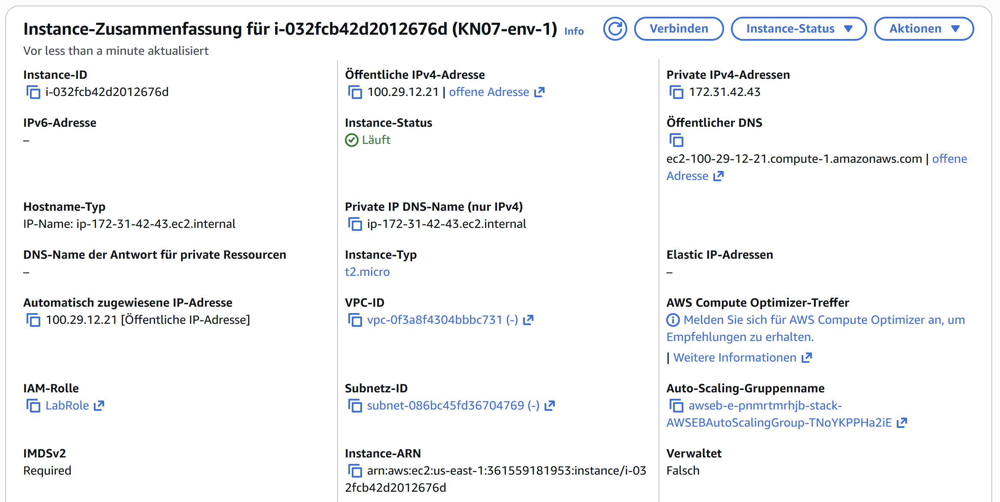
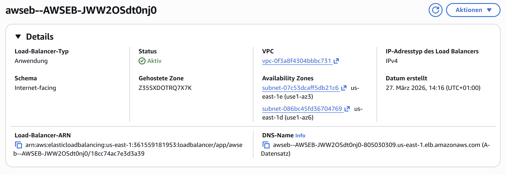
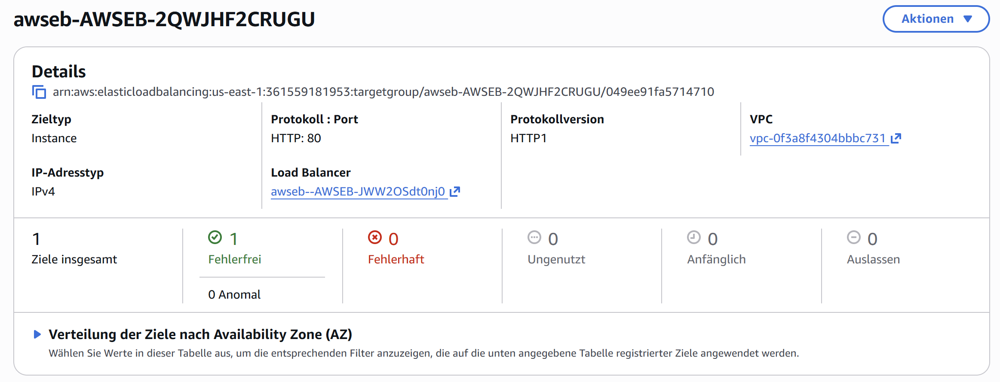
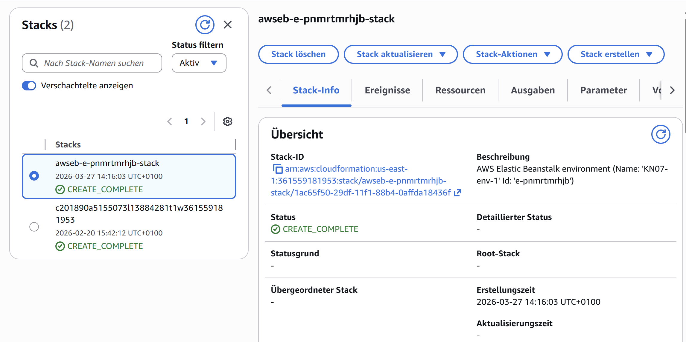

# PAAS
## Auftrag A - Datenbank im PAAS Modell
* MySQLWorkbench Query (db1 admin, tbzm346lina) (db3 admin m346m346)
    
* Wieso ist es besser PAAS oder SAAS Service zu verwenden als eine eigene Datenbank zu installieren?
    * Weil es sehr viel Zeit & Aufwand spart. Es ist kein Setup nötig (man muss nichts installieren), keine Wartung (updates etc macht Anbieter), ist skalierbar (leistung lässt sich anpassen). 
## Auftrag B - PAAS Applikation erstellen
* Screenshots der veränderten Bereiche
    * Ausgewählt weil es bei Dominik funktioniert hat.
    
    * Damit AWS berechtigung hat die Ressourcen zu erstellen
    
    * Damit Anfragen auf mehrere Sever verteilt wird und kaputte Instanzen ersetzt werden 
    
    * Mindestens zwei unterschiedliche damit bei Ausfall LoadBalancer auf ein anderes Subnet ausweichen kann
    
    * Monitoring um zu sehen ob die App richtig läuft
    
## Auftrag C - Erstellen Ressourcen/Objekte und CloudFormation
* Erklärung:
    * Was ist CloudFormation? 
    * Was ist der Unterschied zu Cloud-Init (beides sind AUtomatisierungen)? 
* Screenshots der verschiednen EC2-Objekte die automatisiert wurden:
    * 
    * 
    * 
    * 
    * 
* Screenshots der CloudFormation Ressourcen für meine PAAS Anwendung:
    * 
---