# PFaaS und Backup
## Auftrag A - Backup-Script
* Screenshot Instanze mit korrektem Tag
   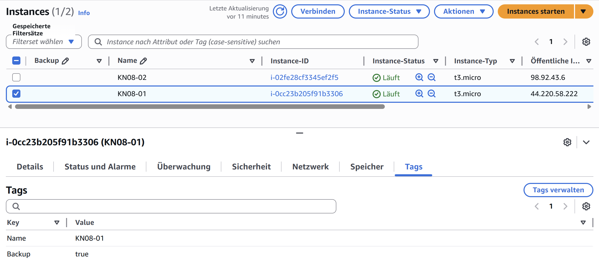 
   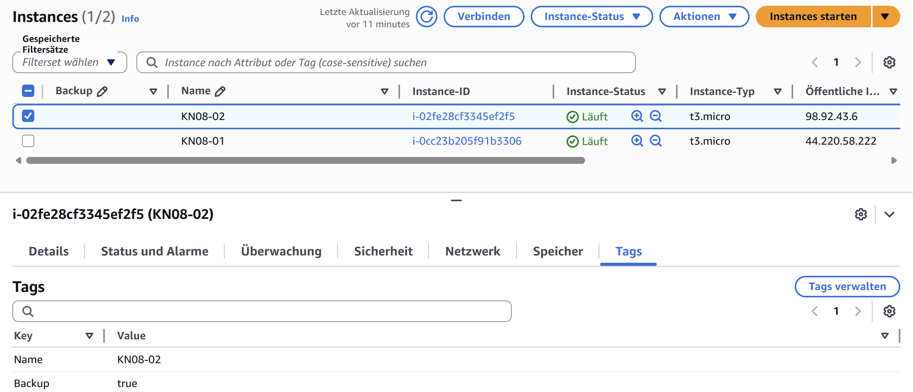 
* Screenshot Lamnda Funktion Backup
   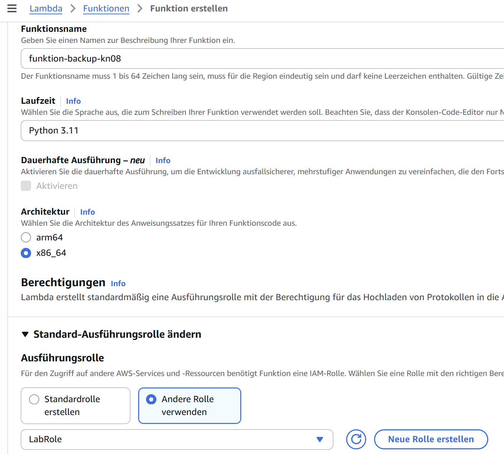 
   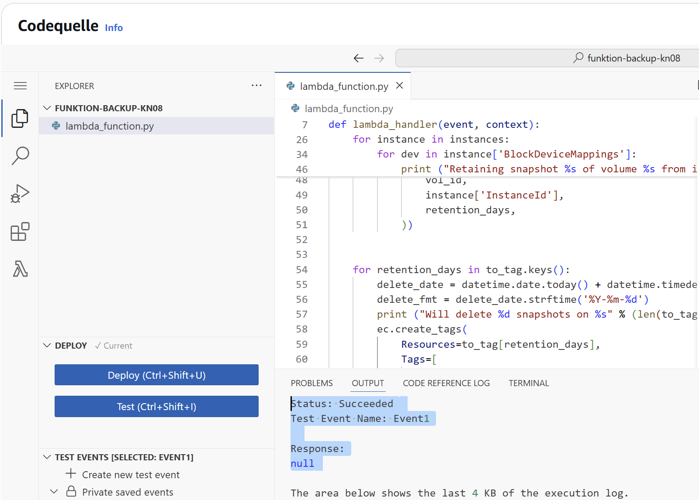 
* Screenshot der Liste der erstellten Snapshots
   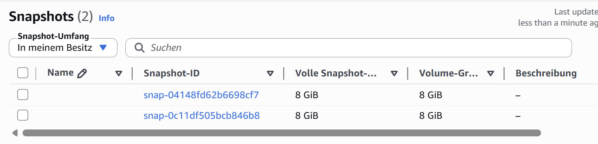 
* Screenshot Tags eines erstellten Snapshots
   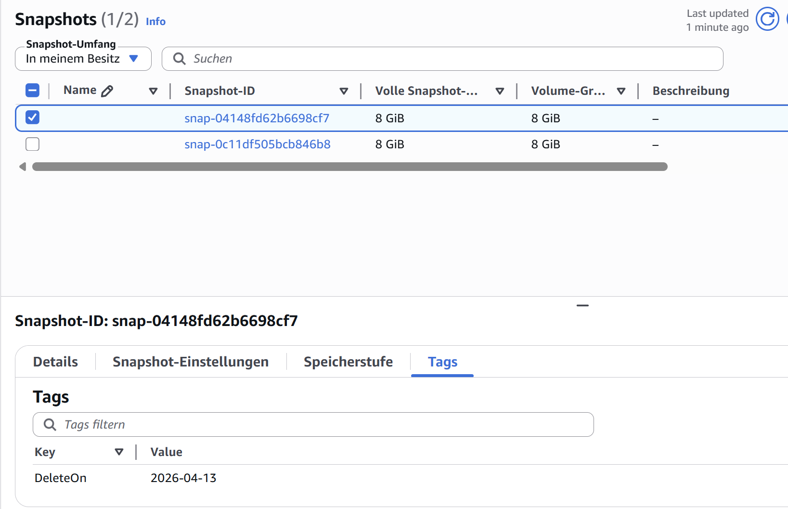 
* Screenshot Lamnda Funktion Cleanup
   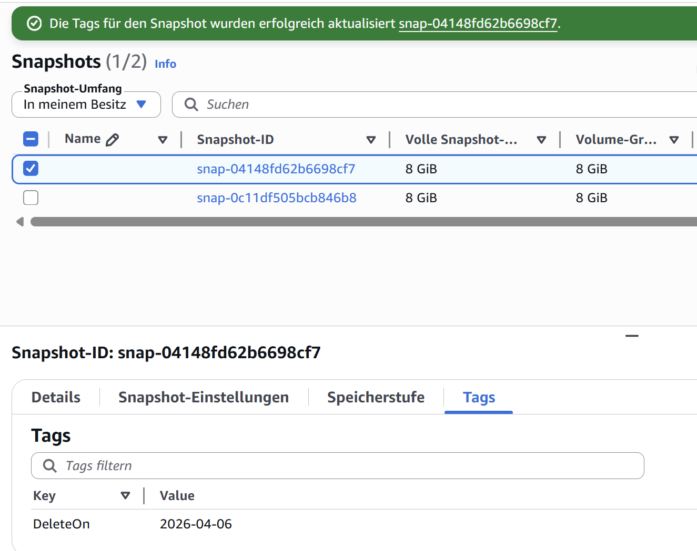 
   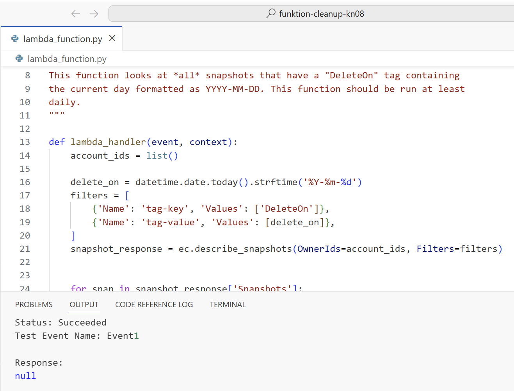 
* Screenshot Liste nachdem Cleanup 
   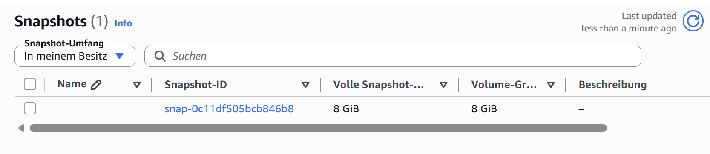 
## Auftrag B - CORN-Job
* Skripte nicht manuell sonder automatisch ausführen mit Zeitplan -> Schedule: Zeitplan erstellen
   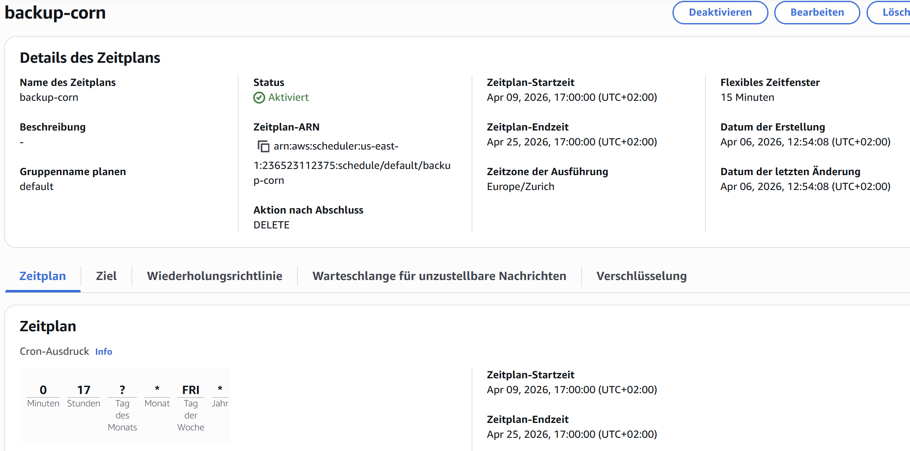 
   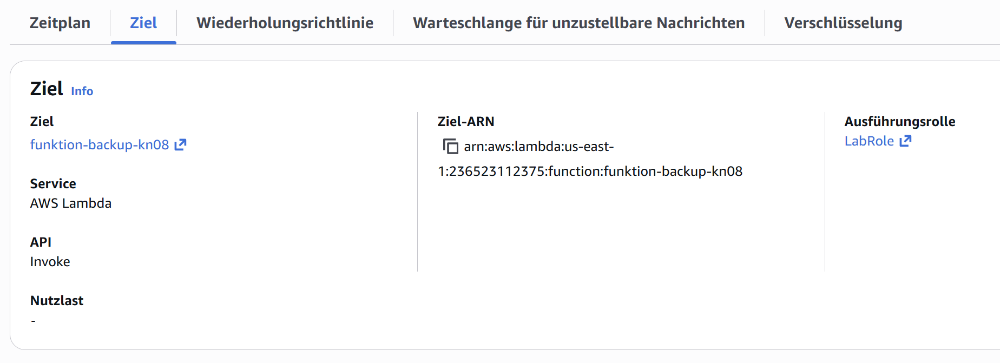 
   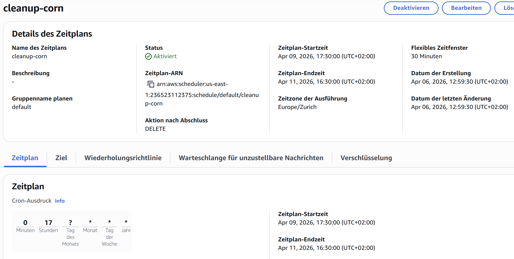 
   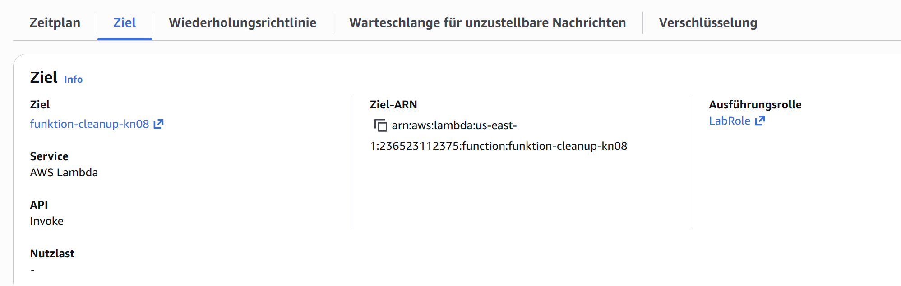 
---s