# Automation
## Auftrag A - Automatisierung mit Command Line Interface
* Screenshot der Deatils der Instanze -> die gestoppt & gestartet wird
   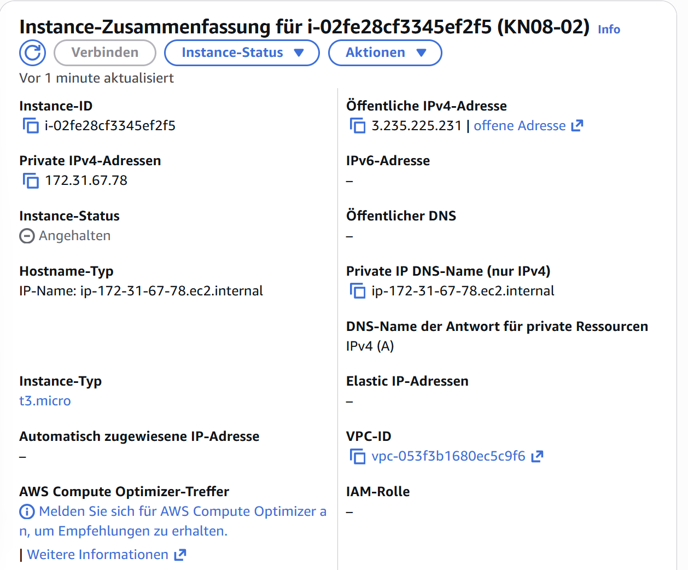 

* Befehle 
   * AWS CLI Zurgiff: Pasten in ~/.aws/credentials file 
     
     ```
     aws configure
     ```
   * Anagben im ~/.aws/config eingeben 
      ```
      AWS Access Key ID [None]: ASIA...
      AWS Secret Access Key [None]: dings..
      Default region name [None]: us-east-1
      Default output format [None]: json
      ```
   * Instanzen auflisten:
     ```
     aws ec2 describe-instances | grep -i instanceid
     ```
     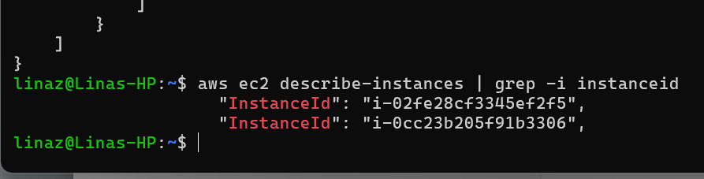 
   * Instanze stoppen:
     ```
     aws ec2 stop-instances --instance-ids i-02fe28cf3345ef2f5
     ```
     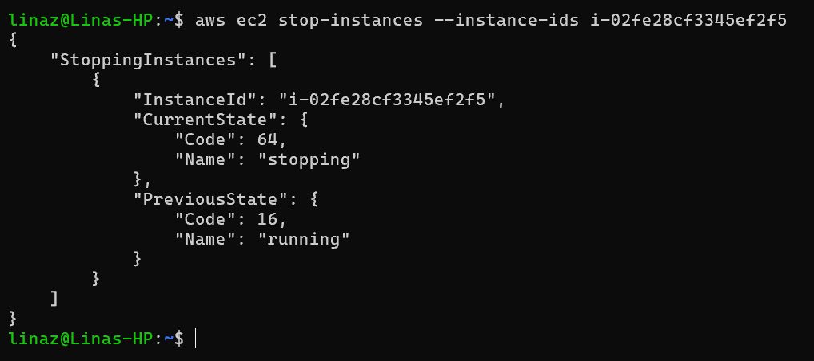 
   * Instanze starten:
     ```
     aws ec2 start-instances --instance-ids i-02fe28cf3345ef2f5
     ```
     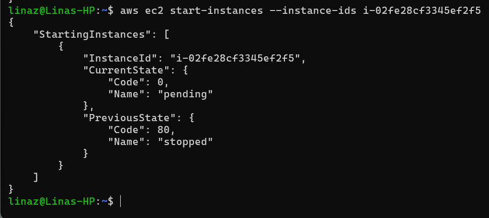 

   * Neue Instanz erstellen:
      * Imageid finden:
         ``` 
         aws ec2 describe-instances | grep ami
         ``` 
      * Instanze erstellen
         ``` 
         aws ec2 run-instances \
         --image-id ami-0ec10929233384c7f \
         --instance-type t2.micro \
         --user-data "file:///mnt/c/Users\linaz\OneDrive\Desktop\m346\m346_lina\KN05\cloud-init-db.yaml"
         ``` 
         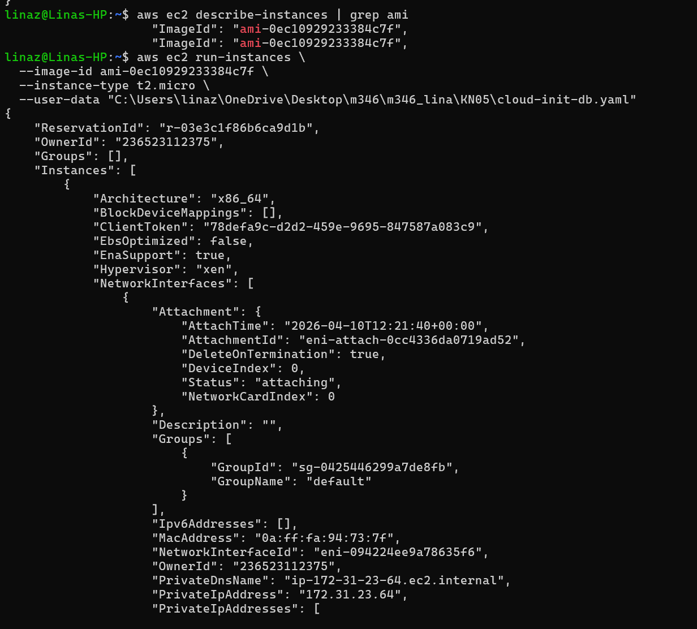 
      * Sicherheitsgurppe anpassen 
         ``` 
         aws ec2 authorize-security-group-ingress \
         --group-id sg-0425446299a7de8fb \
         --protocol tcp \
         --port 3306 \
         --cidr 0.0.0.0/0
         ``` 

* Details der neu erstellten Instanz
     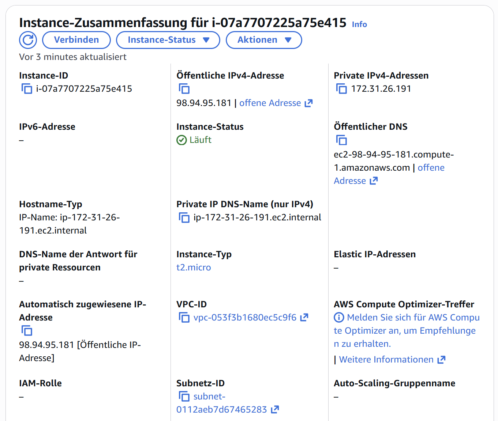 

* Screenshot Telnet Command
     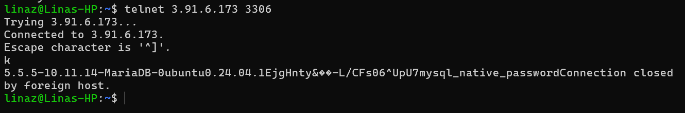 


* Befehle um KN05 via CLI nachzubilden
   * Subnetzt erstellen
      ``` 
      aws ec2 create-subnet \
      --vpc-id vpc-0a12bc34de56f7890 \
      --cidr-block 172.31.64.0/20 \
      --availability-zone us-east-1
      ```
      -> Ausgabe:
        "SubnetId": "subnet-0f3a91c2d8e7b6a45",
        "VpcId": "vpc-0a12bc34de56f7890",
        "State": "pending",
        "CidrBlock": "172.31.64.0/20",
        "AvailabilityZone": "us-east-1a"

   * Sicherheitgruppe Web-Server erstellen
      ``` 
      aws ec2 create-security-group \
      --group-name sg-web \
      --description "Security Group für Web Server" \
      --vpc-id vpc-0a12bc34de56f7890
      ```
      -> Ausgabe: "GroupId": "sg-0223456789abcdef0"

   * Sicherheitgruppe Web-Server anpassen
      ``` 
      aws ec2 authorize-security-group-ingress \
      --group-id sg-0223456789abcdef0 \
      --protocol tcp \
      --port 22 \
      --cidr 0.0.0.0/0
      ```
      ``` 
      aws ec2 authorize-security-group-ingress \
      --group-id sg-0223456789abcdef0 \
      --protocol tcp \
      --port 80 \
      --cidr 0.0.0.0/0
      ```   
   * Sicherheitgruppe DB erstellen
      ``` 
      aws ec2 create-security-group \
      --group-name sg-db \
      --description "Security Group für DB Server" \
      --vpc-id vpc-0a12bc34de56f7890
      ```
      -> Ausgabe: "GroupId": "sg-0123456789abcdef0"

   * Sicherheitgruppe DB anpassen
      ``` 
      aws ec2 authorize-security-group-ingress \
      --group-id sg-0123456789abcdef0 \
      --protocol tcp \
      --port 22 \
      --cidr 172.31.64.0/20
      ```
      ``` 
      aws ec2 authorize-security-group-ingress \
      --group-id sg-0123456789abcdef0 \
      --protocol tcp \
      --port 3306 \
      --cidr 172.31.64.0/20
      ```
   * Elastische IP erstellen
      ``` 
         aws ec2 allocate-address --domain vpc
      ``` 
      -> Ausgabe:
         "PublicIp": "3.120.45.78",
         "AllocationId": "eipalloc-0a9c8b7d6e5f43210",
         "Domain": "vpc"
   * Web Instanz erstellen
      ``` 
      aws ec2 run-instances \
      --image-id ami-0c02fb55956c7d316 \
      --instance-type t2.micro \
      --subnet-id subnet-0f3a91c2d8e7b6a45 \
      --private-ip-address 172.31.64.20 \
      --security-group-ids sg-0223456789abcdef0 \
      --user-data "file:///mnt/c/Users\linaz\OneDrive\Desktop\m346\m346_lina\KN05\cloud-init-web.yaml"
      ``` 
      -> Ausgabe:
         "InstanceId": "i-0b1c2d3e4f5a6b7c8",
            "PrivateIpAddress": "172.31.64.20",
            "SubnetId": "subnet-0f3a91c2d8e7b6a45",
            "State": {
                "Name": "pending"
            }
   * Elastische IP zuweisen
      ``` 
      aws ec2 associate-address \
      --allocation-id eipalloc-0a9c8b7d6e5f43210 \
      --instance-id i-0b1c2d3e4f5a6b7c8 \
      --private-ip-address 172.31.64.20
      ``` 
      -> Ausgabe: "AssociationId": "eipassoc-0a112233445566778"
   * DB Instanz erstellen
      ``` 
      aws ec2 run-instances \
      --image-id ami-0c02fb55956c7d317 \
      --instance-type t2.micro \
      --subnet-id subnet-0f3a91c2d8e7b6a45 \
      --private-ip-address 172.31.64.10 \
      --security-group-ids sg-0123456789abcdef0 \
      --user-data "file:///mnt/c/Users\linaz\OneDrive\Desktop\m346\m346_lina\KN05\cloud-init-db.yaml"
      ``` 
   
* Automatisierung mit CLI
   * Nicht so einfach-> Abhängigkeit zwischen den einzelnen Ressourcen muss berücksichtigt werden -> Reihenfolge. Dynamische Werte (wie ids) müssen gespeichert/ in bezug genommen werden 
   * Planen -> Was ist von was Abhänigig?, Reihenfolge der CLI Befehle, Ids extrahieren 


## Auftrag B - Terraform 
* Konfigurations Datei - main.tf
   [Terraform Konfig-File - main.tf](main.tf)
* Screenshot des Telnet-Befehls
   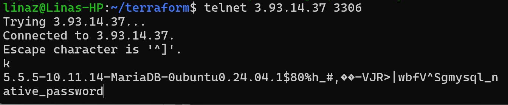 
* Konsolen-Befehl um Terraform auszuführen (initialise & apply)
   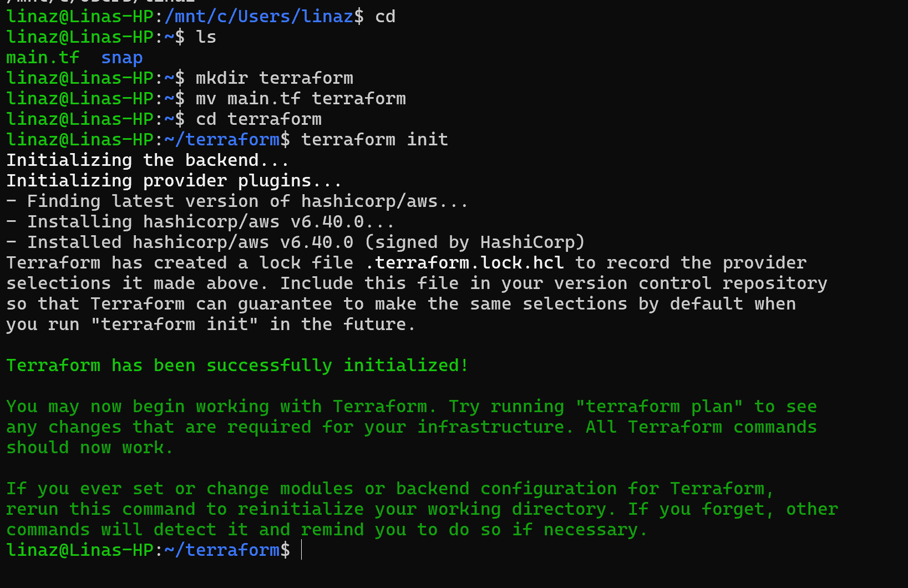 
   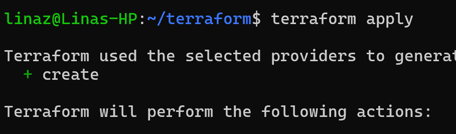 
   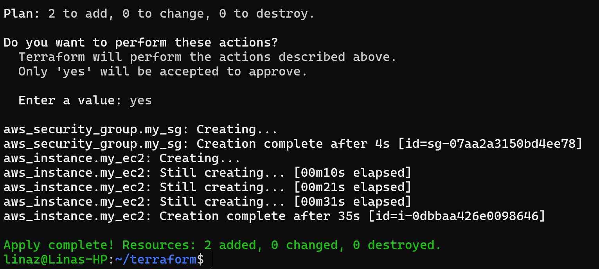 
   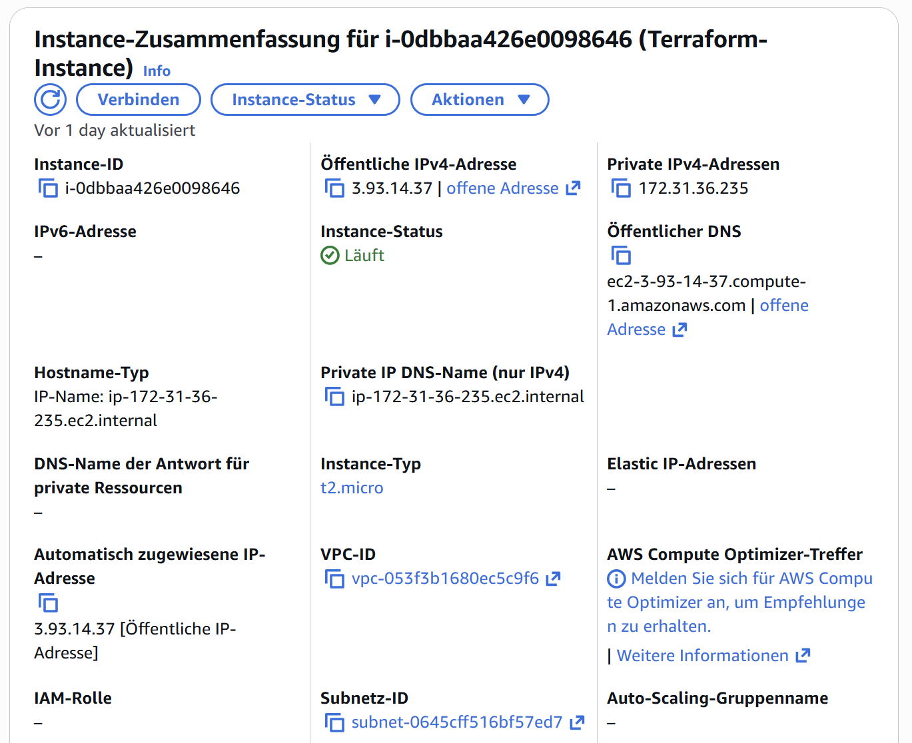 
* Wieso nicht mehr notwendig bei Terraform  
   * CLI muss ich Reihenfolge & Abhängigkeit wissen
   * Bei Terraform werden eifach Referenzen genommen -> Ids müssen nicht selbst gespeichert werden
      ``` 
      subnet_id = aws_subnet.my_subnet.id
      ``` 
   * Terraform erstellt Reihenfolge selbst, man muss nur Zielzustand angeben und nicht den Prozess


